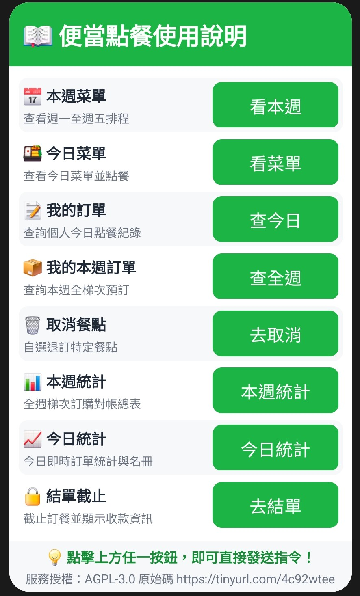

# LINE Bot 訂便當/點餐小幫手 (Meal Ordering LINE Bot)

> 專為 LINE 群組與多人聊天室打造的每日/每週便當訂餐與費用統計機器人。
> 基於 **Google Apps Script (GAS)** 與 **Google Sheets (試算表)**，**100% 零伺服器成本、完全符合 Free Tier 免費配額**。

---

## ✨ 核心特色

- 💰 **100% 永久免費運行**：
  - 善用 LINE Messaging API 的 `replyMessage`（回覆訊息），**完全免費且無數量上限**，徹底避開每月 200 則 Push Message 廣播額度限制。
  - Google Apps Script 雲端無伺服器架構，免自架 VPS、免 Heroku / AWS 費用。
- 📅 **週一至週五店家排程 & 一梯次跨日預定**：
  - 支援週一到週五每天指定不同配合店家與菜單。
  - 全組同仁可一次預約整週餐點（例如：`週一 排骨飯+1, 週二 炸雞腿+1, 週四 燒肉飯+1`）。
  - 自動產出「本週梯次統計表」，各日小計、店家叫餐總量、全週個人應付金額一目了然。
- 🍔 **Uber Eats 店家菜單自動抓取與匯入**：
  - 輸入 Uber Eats 店家網址，自動爬取分類、菜名、價格與描述，一鍵匯入至指定星期菜單！
  - 支援 Google 試算表選單操作與 LINE 群組聊天室指令兩種匯入方式。
- 📑 **從自訂餐廳工作表一鍵匯入菜單**：
  - 在試算表中建立店家名稱的專屬工作表（例如：`老王便當`），點選試算表選單「📑 從自訂餐廳匯入菜單」，一鍵同步填入 `WeeklySchedule` 與 `Menu`！
  - 支援嚴格排除系統專用工作表（`Config`、`Logs`、`WeeklySchedule`、`Menu`、`Orders`、`Children`、`Summary`）與防呆錯誤提示（目前僅由試算表管理者操作，避免群組成員誤觸）。
- 📊 **Google 試算表即時資料庫 & 管理員自訂介面**：
  - 自動建立與維護 `Config`、`WeeklySchedule`、`Menu`、`Orders`、`Summary`、`Children` 六大工作表。
  - `Orders` 完整記錄每筆訂單之 `UserId`、`UserName`、訂餐當下之使用者暱稱 (`UserNickname`) 以及**分餐對象 (`ChildName`)**，對照真實身份零誤差。
  - `Children` 名冊完整管理每位同仁名下登記之小孩（`ChildName`、班級備註 `Note`），支援 LINE 聊天室指令與試算表雙向同步。
  - 管理員可直接在試算表中調整每天店家、菜單與截止時間，即時讀取生效。
  - Google 試算表整合 **「🍱 便當訂餐管理」** 自訂選單，方便一鍵初始化結構、匯入外送菜單、匯入自訂餐廳菜單與重算統計。
- 👦 **多小孩（大寶/二寶）分餐管理與按鈕直選體驗**：
  - **有小孩家長自動分流**：家長點擊「+1 點餐」按鈕時，LINE 畫面底部自動彈出 Quick Reply 浮動按鈕（`[👦 大寶]`、`[👦 二寶]`、`[👤 本人]`、`[✏️ 其他備註]`），兩指輕點直選完成分餐，免手動打字！
  - **點餐語法與自動拆單**：支援括號 `+1 招牌便當 (大寶)`、自動拆單 `+2 排骨飯 (大寶, 二寶)`、以及前綴 `大寶: 排骨飯+1`。
  - **精準查詢、獨立退訂與統計對帳**：`我的訂單` 與退訂卡片均清楚標註小孩名稱，執行 `取消 大寶 招牌便當` 僅取消大寶餐點而不影響他人；今日統計與本週統計亦完整列出各小孩應付明細。
  - **幫助選單與直覺子選單**：「`幫助`」卡片整合「`👶 設定小孩`」按鈕，點擊即自動跳出小孩管理子選單卡片（查看名單、批次登記、新增小孩、刪除小孩），一鍵直覺操作。
- 🍱 **彈性點餐語法 & 互動 Flex Message**：
  - 支援直覺文字指令：`+1 排骨飯`、`週一+1 雞腿飯`、`排骨飯*1, 珍奶*2`、`取消 週二 全部`。
  - **點餐收據範圍彈性設定**：點餐完成後回傳的「✅ 加購成功」收據預設彙整成員**本週梯次所有預訂**（`ORDER_RECEIPT_SCOPE=WEEKLY`），亦可於 `Config` 設定為僅顯示當日（`DAILY`）。
  - **逾期與截止防護鎖定 & 嚴格取消權限隔離**：查詢本週訂單時已過期天數標註 `🔒[已過期]` 禁止修改刪除；今日若過截止時間或已結單則標註 `🔒[已截止]` 禁止異動。一般成員僅能取消自己訂購的餐點（防止誤刪他人訂單）；只有開單人可取消全體當日或所有未截止訂單，且均需透過紅色警告卡片進行**二次確認**方可執行。
  - **開單人即時異動通知**：任何週一至週五梯次之新增加訂與取消餐點，系統即時透過 LINE Push API 通知開單人（`ORGANIZER_ID`），點餐狀況完全透明掌握。
  - **多元結單模式與支付方式**：支援依設定截止全週或當日訂單（`CLOSE_ORDER_SCOPE`），結單卡片整合 **LINE Pay 轉帳**（支援商家連結或個人 LINE 錢包好友轉帳與好友暱稱指引）、**銀行跨行匯款帳號** 與 **收款 QR Code 圖片**（支援 Google Drive 分享連結自動轉換，點擊可放大掃碼）。

---

## 🚀 快速開始與部署

詳細圖文步驟請參閱 👉 [完整部署指南 (docs/deployment_guide.md)](docs/deployment_guide.md)

### 3 步極速上線：
1. **申請 LINE Messaging API (免費)**：
   - 在 [LINE Developers](https://developers.line.biz/) 建立 Provider 與 Messaging API Channel。
   - 取得 `Channel Access Token` (長效權杖) 與 `Channel Secret`。
   - 設定官方帳號：**關閉自動回應訊息**、**開啟 Webhook**、**允許加入群組與多人聊天室**。
2. **建立 Google Apps Script (免費)**：
   - 開啟 Google 雲端硬碟建立空白 Google 試算表，點擊 **擴充功能 -> Apps Script**。
   - 將專案中的 [`dist/Code.gs`](dist/Code.gs) 內容完整複製並貼入編輯器。
   - 於「專案設定」->「指令碼屬性」填入 `CHANNEL_ACCESS_TOKEN` 與 `CHANNEL_SECRET`。
   - 點擊「部署」->「新增部署」->「網頁應用程式 (Web App)」-> 存取權限設為「所有人 (Anyone)」，複製 Web App URL。
3. **綁定 LINE Webhook**：
   - 將 Web App URL 貼回 LINE Developers 的 Webhook URL 並點擊 **Verify** 驗證通過即可！

---

## 💬 聊天室指令清單

將機器人邀請至群組後，全體成員即可使用以下指令：

| 指令 | 說明 | 範例 |
| :--- | :--- | :--- |
| `本週菜單` | 顯示週一至週五每日配合店家與排程卡片 | `本週菜單` |
| `週X菜單` | 查看指定星期的店家專屬菜單卡片 | `週一菜單`、`週二菜單` |
| `週X+1 [餐點]` | 跨日/梯次點餐（單則訊息可預約整週多日餐點） | `週一 排骨飯+1, 週二 炸雞腿+1, 週四 控肉飯+1` |
| `+1 [餐點名稱]` | 當日快速點餐（預設 1 份；有登記小孩時自動彈出 Quick Reply 直選按鈕） | `+1 招牌排骨飯` |
| `+1 [餐點] ([小孩名])` | 指定分配給特定小孩（支援小括號、中括號與前綴冒號） | `+1 招牌便當 (大寶)`、`大寶: 排骨飯+1` |
| `+[數量] [餐點] ([多位小孩])` | 一次點多份並自動依小孩拆單記錄 | `+2 排骨飯 (大寶, 二寶)` |
| `[餐點]+[數量]` | 指定份數點餐 | `酥炸雞腿飯+2` |
| `[餐點]*[數量]` | 乘號語法點餐 | `古早味控肉飯*1, 綠茶*2` |
| `設定小孩` / `小孩選單` | 開啟小孩與用餐對象管理選單卡片（幫助卡片亦有專屬快捷按鈕） | `設定小孩`、`小孩選單` |
| `我的小孩` / `小孩名單` | 查詢已登記的小孩名冊與快速點餐指引（圖文卡片） | `我的小孩`、`小孩名單` |
| `設定小孩 [小孩1], [小孩2]` | 批次綁定登記個人名下的小孩名冊 | `設定小孩 大寶, 二寶` |
| `新增小孩 [姓名] [備註]` | 新增單一小孩與班級/年級備註 | `新增小孩 小寶 附小三年二班` |
| `刪除小孩 [姓名]` | 移除名下指定的小孩紀錄 | `刪除小孩 小寶` |
| `我的本週訂單` | 查詢自己整週（週一至週五）預約明細、小孩分配標籤與總金額 | `我的本週訂單` |
| `我的訂單` | 查詢個人今日點餐紀錄與小孩分配標籤 | `我的訂單` |
| `取消 [週幾] [小孩] [餐點]` | 取消已點的餐點（支援指定星期、特定小孩或全部） | `取消 週二 全部` 或 `取消 大寶 排骨飯` |
| `本週統計` / `梯次統計` | 查看週一至週五全體訂購總量與每位成員應付金額（含小孩分派名冊） | `本週統計` |
| `今日統計` / `本日統計` / `統計` | 即時查看群組今日點餐品項匯總與成員應付名冊（清楚標註各大寶二寶餐點） | `今日統計`、`統計` |
| `今日文字統計` / `文字統計` | 快速取得今日點餐純文字統計（含品項、同仁明細與金額） | `今日文字統計`、`文字統計` |
| `結單` / `本週結單` / `今日結單` | 截止訂餐，產出叫餐總表與付款資訊（LINE Pay / 銀行匯款） | `結單`、`本週結單` |
| `開單 [店家名] [時間]` | 發起今日單日自選開單 | `開單 老王便當 11:30` |
| `匯入菜單 [週X] [網址]` | 透過 Uber Eats 店家網址自動匯入菜單 | `匯入菜單 週一 https://www.ubereats.com/...` |
| `設定語言` / `lang` | 切換個人操作與顯示語言（需開啟 `ENABLE_USER_LOCALE`） | `設定語言`、`設定語言 en`、`lang ja` |
| `幫助` | 顯示所有指令與使用教學卡片 | `幫助` |

### 📖 幫助選單展示

輸入「`幫助`」或「`說明`」時，機器人將傳送具備快捷按鈕的互動卡片：

<p align="center">
  <br>
  <b>幫助選單</b>
</p>

---

## 🌐 多語系 (i18n) 與多國籍使用者自訂支援

本專案支援完整的國際化架構，初版即支援 **6 大語系**：
- 🇹🇼 **繁體中文 (`zh-TW`)**（系統預設基準）
- 🇺🇸 **English (`en`)**
- 🇯🇵 **日本語 (`ja`)**
- 🇰🇷 **한국어 (`ko`)**
- 🇹🇭 **ภาษาไทย (`th`)**
- 🇮🇩 **Bahasa Indonesia (`id`)**

### 兩大多語系運作模式：
1. **全域單一語系模式 (預設)**：
   - 在試算表 `Config` 工作表中設定 `DEFAULT_LOCALE`（預設為 `zh-TW`），全系統（所有成員與群組）統一採用該語言。
2. **多語系使用者自訂模式 (開關式)**：
   - 於 `Config` 工作表將 `ENABLE_USER_LOCALE` 設定為 `true`。
   - 幫助卡片將自動浮現「`🌐 設定語言 / Language`」按鈕，成員亦可隨時發送「`設定語言`」或「`lang`」呼叫 6 國語言切換卡片。
   - 系統將每個人的語言偏好存入試算表 `UserPreferences` 頁籤，往後的個人收據、訂單查詢與幫助選單即以該成員的母語呈現！
   - 所有指令支援母語別名（如英文發送 `help`、日文 `ヘルプ`、韓文 `도움말`、泰文 `ช่วยเหลือ`、印尼文 `bantuan` 均可正常回應）。

---

## 📁 專案檔案結構

```
order-linebot/
├── .gitignore                      # Git 忽略設定
├── appsscript.json                # Google Apps Script 專案資訊清單 (設定 Asia/Taipei 與 V8 執行階段)
├── package.json                   # 專案腳本與元資料
├── README.md                      # 專案說明與操作指南
├── docs/
│   ├── deployment_guide.md        # 完整免費部署與後台管理圖文教學
│   └── images/
│       └── help_menu.jpg          # 幫助選單互動卡片範例圖
├── src/
│   ├── Config.js                  # 系統環境變數、常數與週排程定義
│   ├── I18n.js                    # 多國語言 (i18n) 引擎、6 國語系辭典與指令別名解析
│   ├── LineService.js             # LINE Messaging API 通訊封裝與簽名驗證
│   ├── SheetService.js            # Google Sheets 讀寫、週排程、公式注入防護與統計匯總
│   ├── UberEatsService.js         # Uber Eats 店家菜單抓取、價格轉換與正規化模組
│   ├── FlexMessage.js             # LINE Flex Message 互動卡片（排程、菜單、梯次統計）
│   ├── OrderService.js            # 自然語言點餐解析器、週梯次狀態機與指令派發
│   └── Code.js                    # GAS Webhook (doPost/doGet) 與 Google 試算表選單擴充
├── dist/
│   └── Code.gs                    # 自動打包的單檔發行版，可直接貼入 GAS 編輯器
├── scripts/
│   └── bundle.js                  # 自動將 8 個 src/ 模組打包至 dist/Code.gs 的腳本
└── tests/
    └── test_order_flow.js         # 包含多語系、週梯次點餐與 Uber Eats 匯入的端到端完整測試套件
```

---

## 🧪 本地測試與構建

本專案支援在完全不聯網或無 GAS 憑證的情況下，在本地進行快速語法檢驗與業務邏輯測試：

```bash
# 執行包含週梯次與 Uber Eats 匯入的端到端測試套件
npm test

# 重新編譯產出 GAS 單一程式碼檔案 (dist/Code.gs)
npm run bundle
```

---

## ❓ 常見問題與除錯 (FAQ)

- **找不到 Channel access token？**
  請注意官方帳號營運後台 (`manager.line.biz`) 僅提供基本資訊，Token 必須至 [LINE Developers Console](https://developers.line.biz/) 的 `Messaging API` 標籤頁最底部點選「Issue」產生。詳細圖解請參閱 [docs/deployment_guide.md#第六部分常見問題與疑難排解-faq--troubleshooting](docs/deployment_guide.md)。
- **LINE 後台按 Verify 提示 302 Found？**
  請檢查 GAS 部署權限是否設為「所有人 (Anyone)」、網址結尾是否為 `/exec`。若已開啟「Use webhook」，通常可直接於群組輸入 `幫助` 測試，機器人正常回覆即代表運作正常。
- **試算表初始化出現 `TypeError: getConfigProperty is not a function`？**
  已於最新版解決變數覆蓋問題，請重新複製最新的 [`dist/Code.gs`](dist/Code.gs) 貼入 Apps Script 編輯器即可。
- **純文字訊息可回覆，但「幫助」或「本週菜單」圖文卡片沒有反應？**
  Flex Message 卡片已全數重構對齊 LINE 官方最新嚴格規範（移除無效 CSS 屬性，改用 `paddingAll` 與標準 `mega` 尺寸），請更新部署最新 [`dist/Code.gs`](dist/Code.gs) 即可。
- **取消訂單選單與防誤刪機制？**
  一般成員輸入「`取消`」開啟的互動選單**僅會顯示其本人訂購的餐點**，絕不出現其他成員的餐點；即便手動輸入他人訂購的菜名，系統亦會比對 `UserName` 嚴格阻擋並提示原訂購人姓名。開單人則可看見全體成員餐點並具備二次確認警告機制。詳細說明請參閱 [docs/deployment_guide.md#q8退訂取消權限選單隔離與二次確認警告機制是如何運作的](docs/deployment_guide.md)。
- **「今日統計」查詢範圍與時區設定？是否受結單方式或收據範圍影響？**
  **「今日統計」/「統計」完全獨立於 `CLOSE_ORDER_SCOPE`（結單範圍）與 `ORDER_RECEIPT_SCOPE`（收據範圍）設定**。無論何時呼叫、無論是在開單中或結單截止後，系統一律只會嚴格查詢屬於今日梯次的訂單資料，並排除其他星期的預約。**程式碼已全面支援 `DayOfWeek` 自動容錯正規化（相容「週一」、「星期一」、「周一」、「禮拜一」、「Mon」、「1」等寫法）與欄位動態適配（相容舊版無星期欄位試算表，自動補建且絕不誤讀 GroupId）**。時區方面直接動態讀取試算表檔案設定之時區，請確認試算表「檔案 ➡️ 設定」時區為 `(GMT+08:00) 台北時間`，亦可在試算表上方選單點擊「`🍱 便當訂餐管理` ➡️ `🕒 檢查 Apps Script 時區與系統時間`」一鍵診斷。詳情參閱 [docs/deployment_guide.md#q9今日統計訂餐名單匯總原理與-apps-script-時區時間確認方式](docs/deployment_guide.md)。
- **開單人身份防偽冒、更換開單人權限鎖定 (`ALLOW_SWITCH_ORGANIZER`) 與公式注入防護？**
  系統開單人管理權限判定嚴格採用 LINE 伺服器簽發的專屬加密 `ORGANIZER_ID` (`userId`)，徹底移除顯示名稱比對，杜絕透過竄改 LINE 暱稱進行的管理員身份偽冒。此外，在 `Config` 中新增 `ALLOW_SWITCH_ORGANIZER` 設定（預設 `true`，設為 `false` 即可鎖定僅限現任開單人重新開單或換店家，防止群組成員發送「開單」誤搶或覆寫開單人身份）。同時針對所有寫入試算表的欄位（包含餐點、小孩姓名備註、Logs）進行全面公式注入防護（`/^\s*[=+\-@\t\r]/` 自動轉義）。詳情請參閱 [docs/deployment_guide.md#q12系統安全性防護機制開單人防偽冒更換開單人權限鎖定與公式注入防護](docs/deployment_guide.md#q12系統安全性防護機制開單人防偽冒更換開單人權限鎖定與公式注入防護)。
- **LINE Developers Webhook 按下 Verify 逾時或資安防偽驗證？**
  LINE Developers Console 的「Verify」按鈕有嚴格的 1 秒逾時限制。本系統已全面實作驗證探針極速回應（< 100ms），跳過耗時的試算表連線，使 Verify 按鈕能立即返回綠色 `Success`。此外，由於 Google Apps Script 平台原生不提供 HTTP Request Headers，本專案支援 Webhook URL Token 雙軌驗證，可在 Webhook URL 加上 `?token=您的CHANNEL_SECRET`，由伺服器自動比對並阻擋未授權存取。詳情請參閱 [docs/deployment_guide.md#4-webhook-存取防偽驗證與-verify-探針加速-webhook-security--probe-fast-path](docs/deployment_guide.md)。
- **使用者個人資料保護與 LINE User ID 隱私去識別化？**
  預設啟用 **`USER_IDENTIFIER_MODE: 'HASHED_ID'`**，採用不可逆的單向加鹽 HMAC-SHA256 雜湊（產生如 `usr_8f9c21b4a7d3e5f0`）取代明文 User ID，在 Google 試算表中絕不留存真實 LINE User ID，即使開放共用試算表檢視權限亦完全無從反查真實帳號。系統同時提供 `NICKNAME`（零技術 ID 純暱稱索引）與 `USER_ID`（傳統模式）供自訂，並可透過 Apps Script 內部屬性 `ORGANIZER_PUSH_ID` 以逗號分隔格式靈活支援「多開單人家長自動辨識推播」或「幹部廣播」，兼顧群組輪流開單與個資私密性。詳情請參閱 [docs/deployment_guide.md#q13使用者個人資料保護與隱私去識別化機制-privacy-protection--de-identification](docs/deployment_guide.md#q13使用者個人資料保護與隱私去識別化機制-privacy-protection--de-identification)。
- **如何將現有存有明文 LINE User ID 的舊試算表升級為雜湊去識別化？**
  本系統提供**雙軌向下相容**（無需修改歷史資料，新訂單自動雜湊且舊訂單依然能正常查單/退訂）。若想徹底抹除歷史明文 User ID，只需更新 [`dist/Code.gs`](dist/Code.gs) 後，點選 Google 試算表選單「`🍱 便當訂餐管理` ➡️ `🔒 一鍵升級歷史 ID 為去識別化雜湊`」，系統即會以批次作業自動將 `Orders`、`Children`、`Config` 內的所有歷史明文 User ID 轉換為 `usr_...` 雜湊代號，具備不重複轉換之冪等性保護。詳情請參閱 [docs/deployment_guide.md#3-如何將現有存有明文-line-user-id-的試算表升級為去識別化雜湊-id](docs/deployment_guide.md#3-如何將現有存有明文-line-user-id-的試算表升級為去識別化雜湊-id)。
- **週六/週末點餐與預約下週餐點？支援週末（週六、週日）開單點餐嗎？**
  - **週六預約下週餐點**：平日模式下（預設 `ALLOW_WEEKEND_ORDERING: 'false'`），只要開單人開放點餐 (`IS_ORDERING_OPEN: 'true'`)，成員在週六即可自由預訂下週一至週五餐點（例如輸入「`+1 招牌排骨飯`」預設預約下週一，或「`週二+1 酥炸雞腿飯`」預約下週二）。下週平日梯次在週六絕不被誤判為已過期！
  - **支援週末訂餐 (`ALLOW_WEEKEND_ORDERING`)**：若週末亦有活動、自習或活動便當需求，只需在 `Config` 工作表中將 `ALLOW_WEEKEND_ORDERING` 設為 `true`，系統即自動擴展為 7 天週期，全面支援週六與週日排程、菜單、點餐截單、結單與統計匯總。詳情請參閱 [docs/deployment_guide.md#q15週末點餐與週六預點下週餐點功能說明-allow_weekend_ordering](docs/deployment_guide.md#q15週末點餐與週六預點下週餐點功能說明-allow_weekend_ordering)。

---

## 📄 開發規範與開源授權 (AGPL-3.0 Compliance)

- 本專案採用 [GNU Affero General Public License v3.0 (AGPLv3)](LICENSE) 授權。
- **重要開源合規須知 (AGPL-3.0 要求)**：
  - 本系統屬於透過網路提供互動的軟體服務（Network-Interactive Service）。依 AGPL-3.0 授權條款，**若您有修改任何程式碼並上線運行提供使用者使用，您必須將修改後的完整原始碼公開上傳至公開的 Git 儲存庫 (public git repo)**（例如 GitHub 或 GitLab）。
  - 同時，請在您的 Google 試算表 `Config` 工作表中，將 **`SOURCE_CODE_URL`** 欄位修改為**您自己的公開 Git 儲存庫網址**。
  - LINE 聊天室中「幫助」說明卡片底部的「服務授權：AGPL-3.0 原始碼」連結會動態讀取此欄位，確保群組使用者隨時可取得對應執行版本的完整原始碼。
- 嚴格遵循 Git 原子化提交規範 (1 commit per file, Signed-off-by, detailed commit body)。
